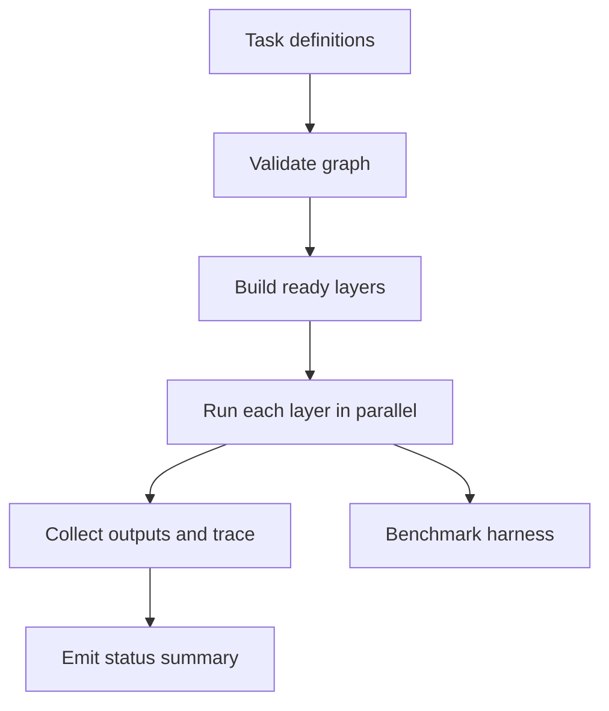

# Workflow Orchestrator TS

TypeScript workflow engine for DAG execution, dependency validation, retry handling, timeouts, layer-level parallelism, and execution tracing.

## Why This Exists

This repo is meant to feel like the core of an internal job runner where correctness, sequencing, observability, and bounded parallelism matter.

## What This Demonstrates

- dependency resolution and invalid-graph detection
- retry, timeout, and execution-status reporting
- layer-aware parallel execution
- execution traces and timing summaries that make orchestration behavior reviewable
- a benchmark path for throughput and orchestration overhead

## Architecture



1. Workflow tasks are registered with dependencies, priorities, retries, and timeouts.
1. The executor validates the graph, builds ready layers, and runs tasks in parallel within each layer.
1. Status, trace, execution order, and duration summary fields make the run reviewable after the fact.

## Tradeoffs

- The engine favors deterministic layering over fully dynamic scheduling so the execution story stays explainable.
- Ready-layer parallelism gives useful throughput without needing a full worker queue or distributed lock manager.
- Failed tasks stop downstream layers, which keeps failure behavior easy to reason about and avoids partial success ambiguity.

## Run It

```bash
npm test
npm run build
npm start
npm run bench
```

## Benchmarking

`npm run bench` executes a synthetic layered DAG repeatedly and prints wall-clock runtime, average workflow time, and throughput per second. That gives a rough signal for orchestration overhead and parallel layer efficiency.

## Verification

Use `npm test` and `npm run build` for correctness, then run `npm run bench` and `npm start` to inspect the execution summary and sample trace output.
